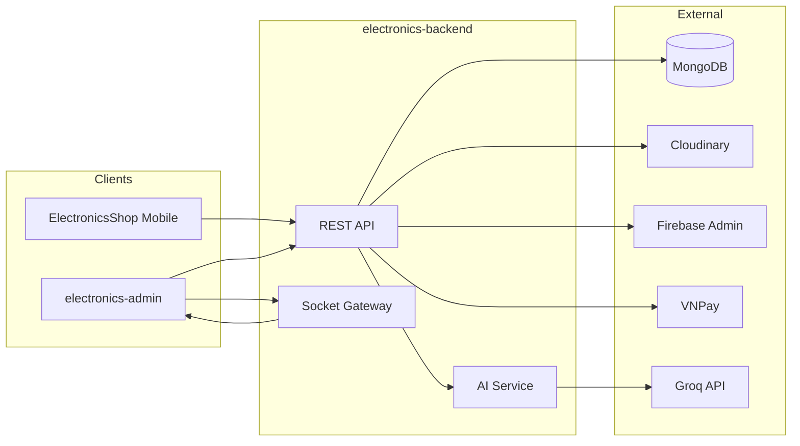
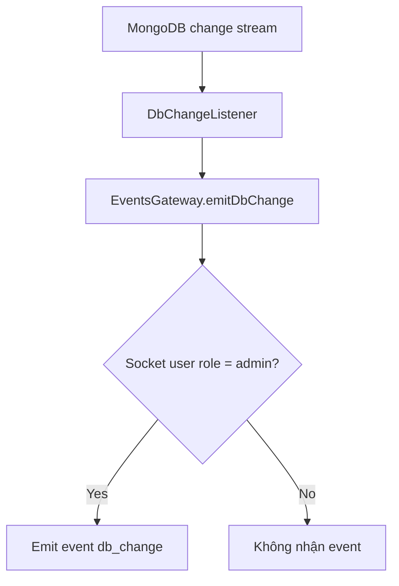
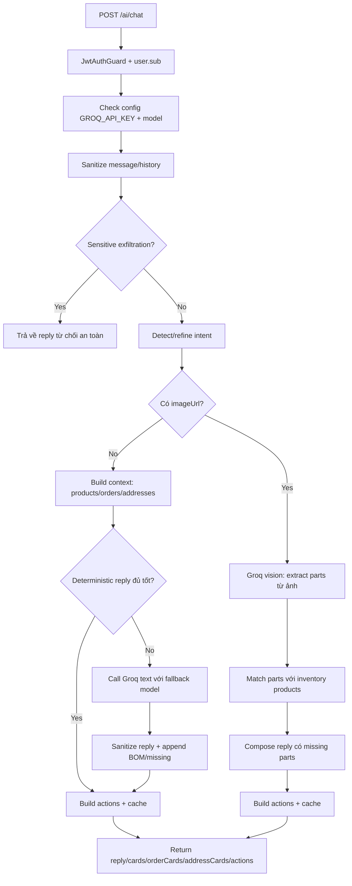
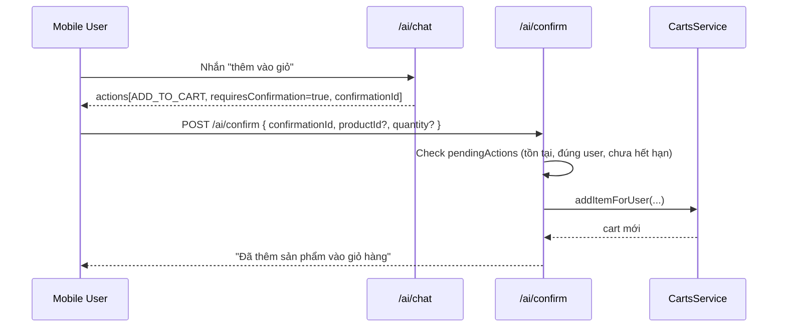

# electronics-backend

Backend API cho hệ thống Electronics Shop, xây bằng **NestJS + MongoDB (Mongoose)**, phục vụ cả Mobile App (`ElectronicsShop`) và Admin Web (`electronics-admin`).

## 1. Tổng quan

- Kiến trúc module theo domain: `auth`, `products`, `orders`, `users`, `payments`, `ai`, ...
- Mặc định API được bảo vệ bằng JWT (global `JwtAuthGuard`), chỉ các route gắn `@Public()` mới mở công khai.
- Có phân quyền theo vai trò với `@Roles('admin')`.
- Có realtime `socket.io` để emit `db_change` cho admin đã xác thực.
- Có tích hợp AI chat qua **Groq API** (text + vision), hỗ trợ tư vấn sản phẩm, đọc ảnh linh kiện/schematic, và action xác nhận thêm giỏ hàng.

## 2. Tech stack

- `NestJS 11`, `TypeScript`
- `MongoDB + Mongoose`
- `JWT + Passport`
- `Socket.IO`
- `Cloudinary` (upload ảnh/file)
- `Firebase Admin SDK` (social login verify + push notifications)
- `VNPay` (online payment)
- `Groq API` (LLM text + vision)

## 3. Kiến trúc hệ thống



## 4. Module chính

```text
src/
├── ai/                    # Chat AI, vision, action confirmation
├── auth/                  # Login/register/refresh/OTP/social login
├── banners/
├── carts/
├── cloudinary/
├── common/                # guards/decorators/firebase/strategies
├── events/                # socket gateway + Mongo change stream listener
├── health/
├── inventory-movements/
├── notifications/
├── orders/
├── payments/              # VNPay create/return/ipn
├── products/
├── reviews/
├── search-trends/
├── shipments/
├── transactions/
├── upload/
├── users/
└── vouchers/
```

## 5. Bảo mật và quyền truy cập

- Global guards trong `AppModule`:
  - `ThrottlerGuard`
  - `JwtAuthGuard`
  - `RolesGuard`
- Quy tắc mặc định:
  - Không có `@Public()` => bắt buộc JWT.
  - Có `@Roles('admin')` => bắt buộc role admin.
- Socket `db_change` chỉ emit tới room `admin` (client socket có JWT role admin).

## 6. Biến môi trường

Tạo `.env` từ `.env.example`:

```bash
cp .env.example .env
```

Biến quan trọng:

- `MONGO_URI` (bắt buộc)
- `JWT_SECRET` (bắt buộc, tối thiểu 32 ký tự)
- `REFRESH_SECRET` (bắt buộc, tối thiểu 32 ký tự)
- `PORT` (mặc định 3000)
- `CORS_ORIGINS` (danh sách URL, phân tách bằng dấu phẩy)
- `SMTP_HOST`, `SMTP_PORT`, `SMTP_USER`, `SMTP_PASS`, `SMTP_FROM` (OTP email)
- `VNP_TMN_CODE`, `VNP_HASH_SECRET`, `VNP_URL`, `VNP_RETURN_URL`, `VNP_IPN_URL` (VNPay)
- `CLOUDINARY_CLOUD_NAME`, `CLOUDINARY_API_KEY`, `CLOUDINARY_API_SECRET`
- `GROQ_API_KEY` (AI)
- `GROQ_MODEL`, `GROQ_MODEL_PRIMARY`, `GROQ_MODEL_SECONDARY`, `GROQ_MODEL_TERTIARY`
- `GROQ_MODEL_VISION` hoặc `GROQ_MODEL_IMAGE` (AI ảnh)
- `GROQ_REQUEST_TIMEOUT_MS` (timeout gọi Groq)
- `FIREBASE_SERVICE_ACCOUNT_PATH` (tuỳ chọn; nếu không có sẽ thử `serviceAccountKey.json` ở root)

Lưu ý:
- Nếu thiếu key Firebase, hệ thống vẫn chạy nhưng push notification/social verify có thể không hoạt động đầy đủ.
- MongoDB change stream cần replica set/sharded cluster để realtime ổn định.

## 7. Cài đặt và chạy

```bash
cd electronics-backend
npm install
npm run start:dev
```

Các script:

- `npm run build`
- `npm run start`
- `npm run start:dev`
- `npm run start:prod`
- `npm run lint`
- `npm run test`
- `npm run test:e2e`
- `npm run test:cov`

## 8. Realtime db_change (admin)

Backend lắng nghe Mongo change stream toàn DB rồi emit metadata tối thiểu:

```json
{
  "collection": "orders",
  "operationType": "update",
  "documentId": "...",
  "changedAt": "...ISO8601..."
}
```



## 9. Chat AI (phần chính)

### 9.1 Endpoint

- `POST /ai/chat` (JWT required)
- `POST /ai/confirm` (JWT required)

### 9.2 Request `POST /ai/chat`

```json
{
  "message": "Tư vấn diode 1A",
  "history": [
    { "role": "user", "content": "Xin chào" },
    { "role": "ai", "content": "Mình có thể giúp gì?" }
  ],
  "imageUrl": "https://...optional..."
}
```

### 9.3 Response điển hình

```json
{
  "reply": "- Gợi ý 2 mã phù hợp...",
  "cards": [
    {
      "productId": "...",
      "name": "Diode 1N4007",
      "price": 1000,
      "stock": 120,
      "image": "https://...",
      "category": "Diode",
      "code": "1N4007"
    }
  ],
  "orderCards": [],
  "addressCards": [],
  "actions": [
    {
      "type": "ADD_TO_CART",
      "payload": { "productId": "...", "quantity": 1 },
      "requiresConfirmation": true,
      "confirmationId": "uuid"
    }
  ]
}
```

### 9.4 Lưu đồ Chat AI (Text)



### 9.5 Lưu đồ xác nhận action (Add to cart)



### 9.6 Cơ chế AI đáng chú ý

- Chống prompt injection và exfiltration ở mức input filtering + policy prompt.
- Fallback model Groq nhiều tầng khi model trước timeout/lỗi tạm thời.
- Cache tạm cho chat, index sản phẩm, ảnh đã parse.
- Hỗ trợ intent theo ngữ cảnh: hỏi sản phẩm, đơn hàng, địa chỉ, BOM/lắp mạch.
- Khi có ý định thêm giỏ hàng, action cần `confirmationId` và hết hạn sau ~10 phút.

## 10. API nhóm chức năng (tóm tắt)

- `auth`: login/register/refresh/otp/social-login
- `products`: CRUD sản phẩm, public list/detail
- `orders`, `shipments`, `transactions`, `inventory-movements`
- `users`, `vouchers`, `reviews`, `banners`, `notifications`, `search-trends`
- `upload`: upload image/file qua backend
- `payments`: tạo payment VNPay + return/ipn callback
- `health`: healthcheck

## 11. Tích hợp với frontend

- Mobile App gọi `POST /ai/chat` và render `cards/orderCards/addressCards/actions`.
- Khi user bấm action, Mobile gọi `POST /ai/confirm` để thực thi.
- Admin Web kết nối socket để nhận `db_change` và refetch dữ liệu realtime.

## 12. Troubleshooting nhanh

- `AI chưa được cấu hình`: kiểm tra `GROQ_API_KEY` và model env.
- Không nhận `db_change`: kiểm tra Mongo replica set + socket token admin.
- Lỗi CORS: kiểm tra `CORS_ORIGINS` (bao gồm cả mobile dev host/web host).
- Lỗi JWT refresh: kiểm tra `JWT_SECRET` và `REFRESH_SECRET` nhất quán giữa các lần deploy.
- VNPay callback không về app: kiểm tra `VNP_RETURN_URL`, deep link app và domain public.

## 13. License

UNLICENSED.
