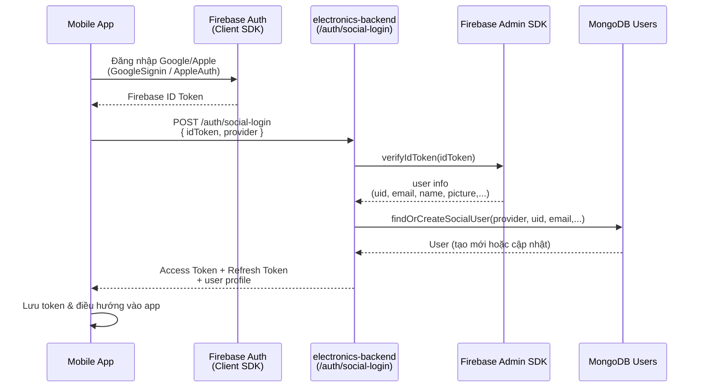

# Electronics Backend

## Mô tả

Đây là máy chủ backend cho ứng dụng Cửa hàng Điện tử (Electronics Shop). Dự án được xây dựng bằng **NestJS**, một framework Node.js tiến bộ, và sử dụng **MongoDB** làm cơ sở dữ liệu. Hệ thống cung cấp một tập hợp các API toàn diện để quản lý sản phẩm, đơn hàng, người dùng, kho hàng, xử lý thanh toán và nhiều hơn nữa.

## Tính năng chính

- **Xác thực & Phân quyền**: Xác thực dựa trên JWT với kiểm soát truy cập dựa trên vai trò (Admin, User).
- **Đăng nhập xã hội (Social Login)**: Đăng nhập bằng Google và Apple thông qua Firebase Authentication, backend xác thực ID token bằng Firebase Admin SDK và phát hành JWT nội bộ.
- **Quản lý sản phẩm**: Các thao tác CRUD cho sản phẩm, danh mục và kho hàng.
- **Xử lý đơn hàng**: Quản lý toàn bộ vòng đời đơn hàng (đặt hàng, theo dõi, hủy đơn).
- **Tích hợp thanh toán**: Tích hợp với VNPay để thanh toán trực tuyến an toàn.
- **Quản lý người dùng**: Hồ sơ người dùng, quản lý địa chỉ và cài đặt tài khoản.
- **Quản lý kho**: Theo dõi biến động kho, mức tồn kho và các lô hàng.
- **Cập nhật thời gian thực**: Sử dụng Socket.io cho thông báo và cập nhật theo thời gian thực.
- **Tải lên hình ảnh**: Tích hợp Cloudinary để lưu trữ và quản lý hình ảnh hiệu quả.
- **Tích hợp AI**: Tích hợp Google Gemini AI cho các tính năng thông minh (ví dụ: trò chuyện, gợi ý).
- **Thông báo**: Thông báo hệ thống và thông báo mục tiêu (thông qua Firebase).
- **Đánh giá & Xếp hạng**: Hệ thống đánh giá sản phẩm.

## Công nghệ sử dụng

- **Framework**: [NestJS](https://nestjs.com/)
- **Ngôn ngữ**: TypeScript
- **Cơ sở dữ liệu**: [MongoDB](https://www.mongodb.com/) (sử dụng Mongoose)
- **Validation**: Joi, class-validator
- **Bảo mật**: Helmet, Bcrypt, Passport
- **Real-time**: Socket.io
- **Lưu trữ đám mây**: Cloudinary
- **Cổng thanh toán**: VNPay
- **AI**: Google Gemini
- **Push Notifications**: Firebase Admin

## Kiến trúc tổng quan hệ thống

Sơ đồ dưới đây mô tả kiến trúc tổng thể giữa Mobile App, Admin, Backend và các dịch vụ bên ngoài:

```mermaid
flowchart LR
    subgraph Clients [Clients]
      A[Mobile App - ElectroAI]
      B[Admin Web - electronics-admin]
    end

    subgraph Backend [electronics-backend (NestJS)]
      C[REST API / WebSocket]
      D[Auth & Social Login<br/>JWT, Google, Apple]
      E[Orders, Products, Inventory,...]
      F[AI Service<br/>Gemini]
    end

    subgraph Infra [External Services]
      G[(MongoDB Replica Set)]
      H[Cloudinary<br/>Image Storage]
      I[VNPay<br/>Payment Gateway]
      J[Firebase Admin<br/>FCM, Token Verify]
      K[Google Gemini API]
    end

    A --> C
    B --> C

    C --> D
    C --> E
    C --> F

    D --> J
    E --> G
    E --> I
    E --> H
    F --> K
```

## Yêu cầu tiên quyết

Trước khi chạy dự án này, hãy đảm bảo bạn đã cài đặt những thứ sau:

- **Node.js**: (Phiên bản khuyến nghị: 18.x trở lên)
- **npm**: (Trình quản lý gói Node)
- **MongoDB**: Bạn có thể sử dụng instance cục bộ hoặc giải pháp đám mây như MongoDB Atlas.

## Cài đặt

1.  **Clone repository:**
    ```bash
    git clone <repository-url>
    cd electronics-backend
    ```

2.  **Cài đặt dependencies:**
    ```bash
    npm install
    ```

3.  **Cấu hình môi trường:**
    Tạo một file `.env` trong thư mục gốc. Bạn có thể bắt đầu bằng cách sao chép file mẫu:
    ```bash
    cp .env.example .env
    ```
    Cập nhật file `.env` với các giá trị cấu hình cụ thể của bạn:
    
    ```env
    MONGO_URI=mongodb+srv://<username>:<password>@<cluster>.mongodb.net/<dbname>
    JWT_SECRET=your_jwt_secret_key
    REFRESH_SECRET=your_refresh_secret_key
    PORT=3000
    CORS_ORIGINS=http://localhost:3000,http://localhost:5173
    
    # Cấu hình SMTP (cho email)
    SMTP_HOST=smtp.example.com
    SMTP_PORT=587
    SMTP_USER=your_email@example.com
    SMTP_PASS=your_email_password
    SMTP_FROM="Electronics Shop <no-reply@example.com>"
    
    # Thanh toán (VNPay)
    VNP_TMN_CODE=your_vnp_tmn_code
    VNP_HASH_SECRET=your_vnp_hash_secret
    VNP_URL=https://sandbox.vnpayment.vn/paymentv2/vpcpay.html
    VNP_RETURN_URL=http://localhost:3000/payments/vnpay_return
    
    # Cloudinary
    CLOUDINARY_CLOUD_NAME=your_cloud_name
    CLOUDINARY_API_KEY=your_api_key
    CLOUDINARY_API_SECRET=your_api_secret

    # Gemini AI
    GEMINI_API_KEY=your_gemini_api_key
    GEMINI_MODEL=gemini-pro
    
    # Firebase Admin (Social Login Google / Apple)
    # Backend sẽ đọc file serviceAccountKey.json trong thư mục gốc (KHÔNG commit file này lên git)
    ```

    > **Lưu ý:** Để phục vụ mục đích kiểm thử hoặc nếu bạn cần file `.env` cụ thể, vui lòng liên hệ:
    > - **Zalo**: 0827733475
    > - **Email**: levanduy.work@gmail.com

## Chạy ứng dụng

### Môi trường phát triển (Development)
```bash
npm run start
```

### Chế độ theo dõi (Watch Mode)
```bash
npm run start:dev
```

### Môi trường sản xuất (Production Mode)
```bash
npm run start:prod
```

## Luồng đăng nhập xã hội (Google / Apple)



## Kiểm thử (Testing)

### Unit Tests
```bash
npm run test
```

### E2E Tests
```bash
npm run test:e2e
```

### Test Coverage (Độ bao phủ)
```bash
npm run test:cov
```

## Cấu trúc dự án

```
src/
├── ai/                 # Các module liên quan đến AI
├── auth/               # Logic xác thực
├── banners/            # Quản lý banner
├── carts/              # Chức năng giỏ hàng
├── cloudinary/         # Dịch vụ upload ảnh
├── common/             # Tài nguyên chung (guards, decorators, filters)
├── config/             # Các module cấu hình
├── events/             # Xử lý sự kiện
├── health/             # Endpoints kiểm tra sức khỏe hệ thống
├── inventory-movements/ # Theo dõi kho hàng
├── notifications/      # Hệ thống thông báo
├── orders/             # Quản lý đơn hàng
├── payments/           # Xử lý thanh toán
├── products/           # Danh mục sản phẩm
├── reviews/            # Đánh giá sản phẩm
├── search-trends/      # Phân tích tìm kiếm
├── shipments/          # Logic vận chuyển
├── transactions/       # Ghi nhận giao dịch
├── users/              # Quản lý người dùng
├── vouchers/           # Mã giảm giá
├── app.module.ts       # Module chính của ứng dụng
└── main.ts             # Điểm khởi chạy ứng dụng
```

## Bảo mật & Môi trường

- **Không commit secrets**: Các file `.env` và `serviceAccountKey.json` đã được cấu hình trong `.gitignore` để **không bao giờ được đẩy lên repository**.
- **Quản lý key**:
  - Mọi giá trị nhạy cảm (DB URI, JWT secret, SMTP password, VNPay, Cloudinary, Gemini API key, Firebase service account, ...) đều phải được cấu hình qua `.env` hoặc file JSON riêng trên server.
  - Nếu bạn clone dự án từ repository, hãy tự tạo `.env` và `serviceAccountKey.json` mới cho môi trường của bạn; **không sử dụng lại key thực tế trong ví dụ**.
- **Social login**:
  - Mobile app sẽ gửi **Firebase ID token** tới endpoint: `POST /auth/social-login` với `provider` là `google` hoặc `apple`.
  - Backend sử dụng Firebase Admin để xác thực token này trước khi tạo/tìm user và phát hành JWT nội bộ.

## Giấy phép (License)

Dự án này là [UNLICENSED](LICENSE).
