# ElectronicsShop Backend

Backend API của hệ thống ElectronicsShop. Cung cấp REST API, Socket.IO realtime, thanh toán VNPAY, upload Cloudinary, push notification (FCM) và AI chat.

## Tech Stack
- NestJS + Node.js
- MongoDB + Mongoose
- JWT Auth + RBAC (admin/customer)
- Socket.IO
- Cloudinary, Firebase Admin, SMTP
- Groq LLM API (OpenAI-compatible)

## Cấu hình môi trường
Tạo `.env` theo mẫu:

```env
MONGO_URI=
JWT_SECRET=
REFRESH_SECRET=
PORT=3000
CORS_ORIGINS=http://localhost:3000,http://localhost:5173,http://127.0.0.1:5173
SMTP_HOST=smtp.gmail.com
SMTP_PORT=587
SMTP_USER=
SMTP_PASS=
SMTP_FROM=
VNP_TMN_CODE=
VNP_HASH_SECRET=
VNP_URL=https://sandbox.vnpayment.vn/paymentv2/vpcpay.html
VNP_RETURN_URL=http://localhost:3000/payments/vnpay/return
VNP_IPN_URL=http://localhost:3000/payments/vnpay/ipn
CLOUDINARY_CLOUD_NAME=
CLOUDINARY_API_KEY=
CLOUDINARY_API_SECRET=
GROQ_API_KEY=
GROQ_MODEL=qwen/qwen3-32b
GROQ_MODEL_PRIMARY=qwen/qwen3-32b
GROQ_MODEL_SECONDARY=openai/gpt-oss-120b
GROQ_MODEL_TERTIARY=llama-3.1-8b-instant
GROQ_MODEL_VISION=meta-llama/llama-4-scout-17b-16e-instruct
GROQ_REQUEST_TIMEOUT_MS=6000
```

## Cài đặt và chạy
```bash
npm install
npm run start:dev
```

## Kiến trúc hệ thống (Backend)
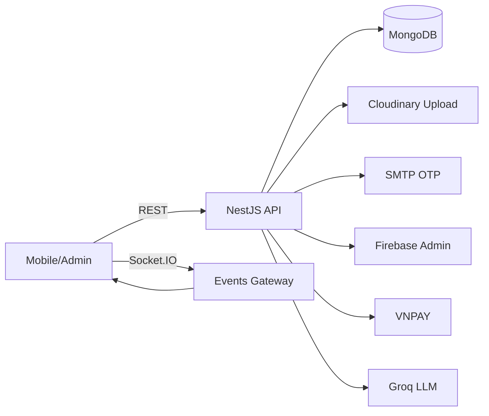

## Module chính
- `auth` đăng ký OTP, login, refresh token, social login
- `users` profile, addresses, favorites, search history, AI chat history/archives
- `products` CRUD sản phẩm + related
- `reviews` review, cập nhật rating stats
- `carts` giỏ hàng + totals
- `orders` tạo đơn, cập nhật trạng thái, rollback/cancel
- `payments` VNPAY flow
- `shipments` vận chuyển
- `transactions` log thanh toán
- `inventory-movements` nhập/xuất kho
- `vouchers` voucher hệ thống + voucher gắn user
- `banners` banner marketing
- `notifications` push + trạng thái đọc
- `upload` upload ảnh/pdf lên Cloudinary
- `ai` AI chat + confirm action
- `search-trends` xu hướng tìm kiếm
- `events` Socket.IO + DB change stream
- `health` health check

## Flow nghiệp vụ chính

### 1) Auth (OTP + JWT)
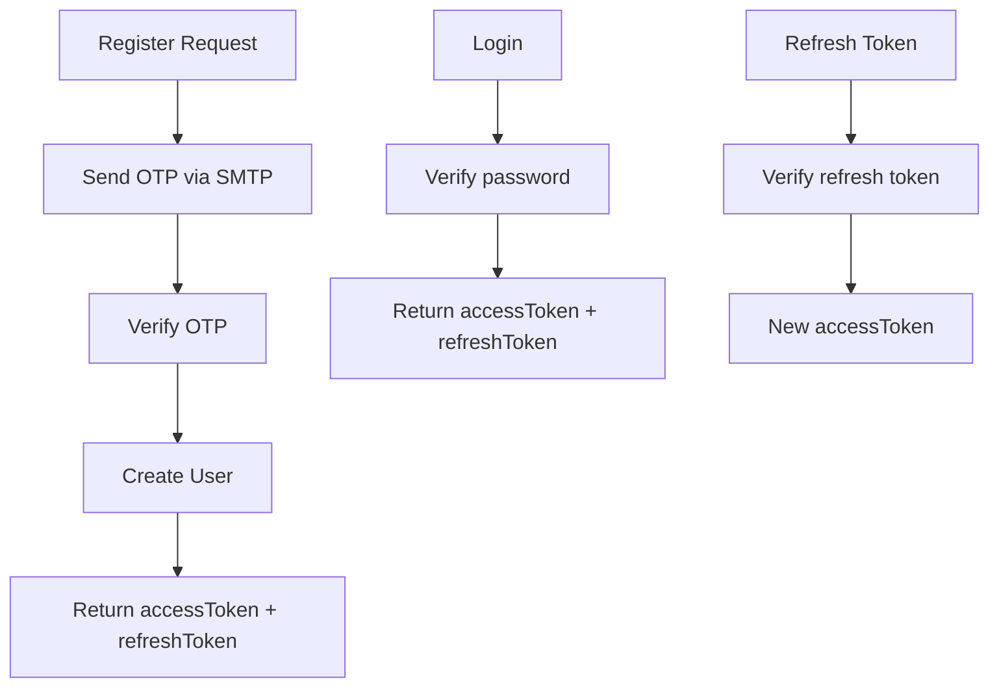

### 2) Giỏ hàng
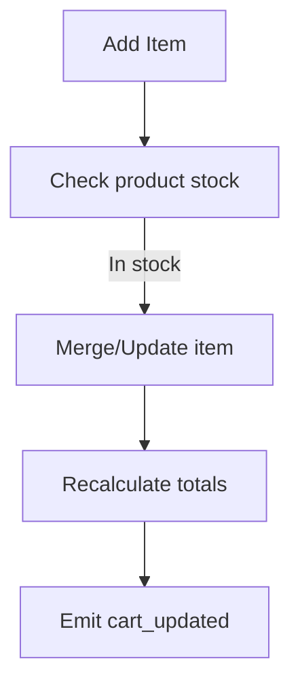

### 3) Đặt hàng + Trừ kho
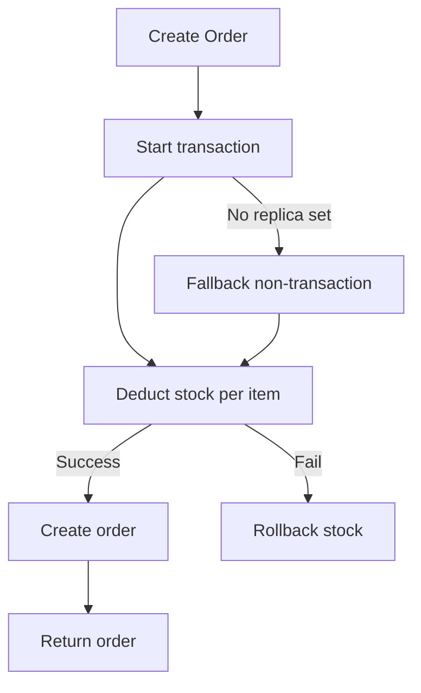

### 4) Thanh toán COD và VNPAY
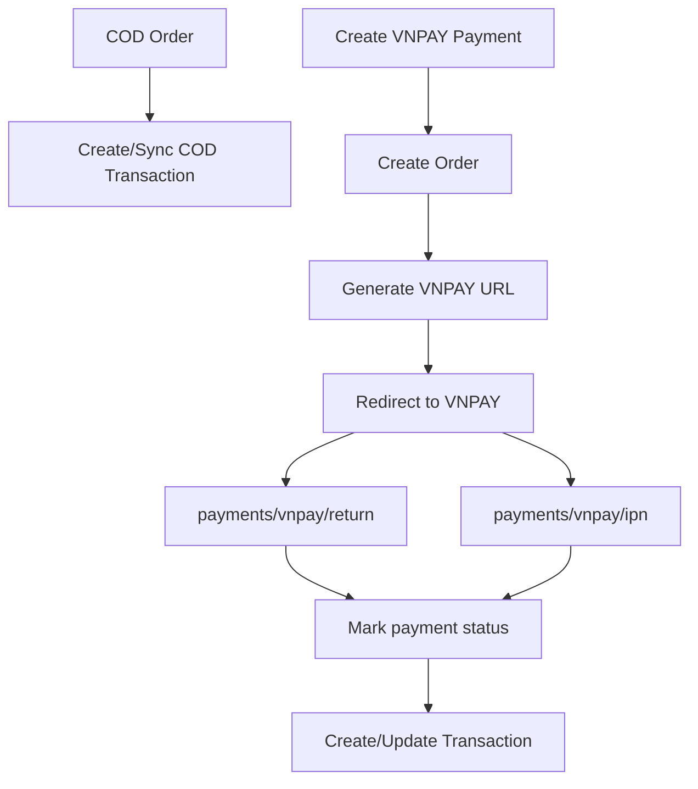

### 5) Shipment
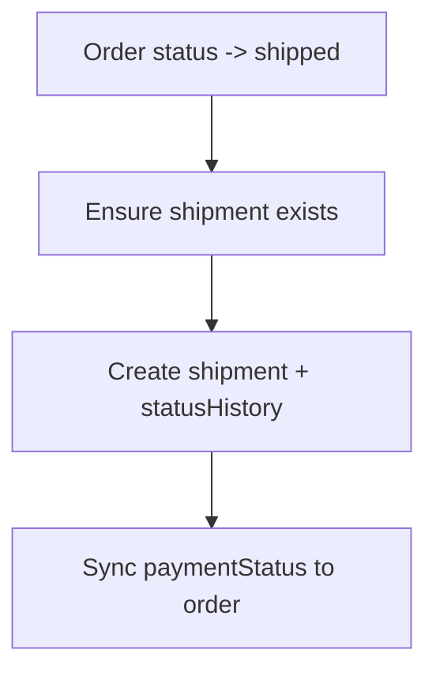

### 6) Inventory movements
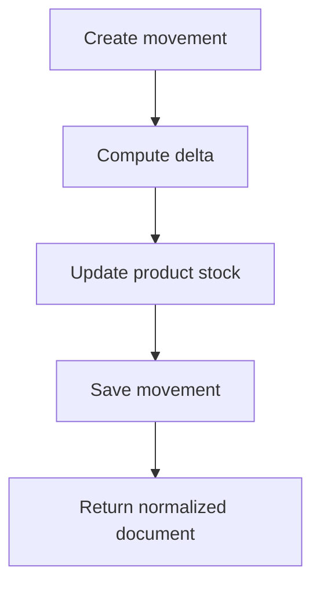

### 7) Notifications
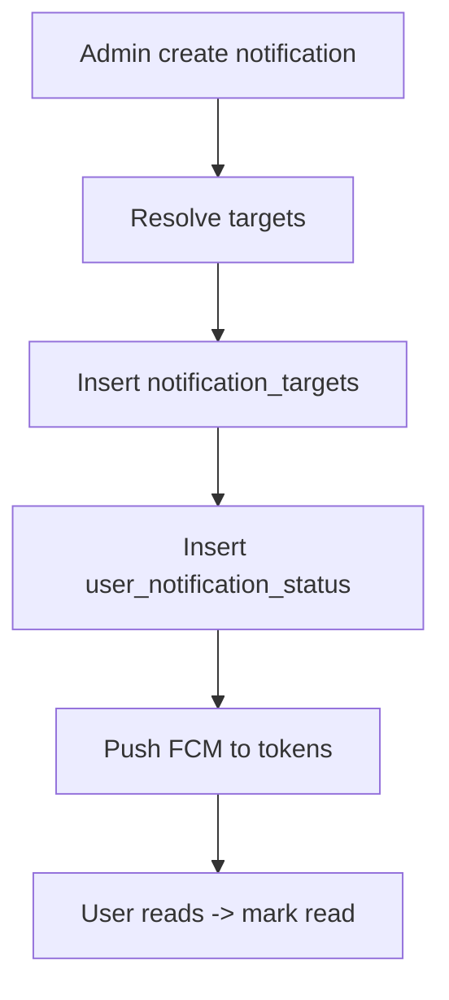

## AI Chat (chi tiết)

### Tổng quan logic
- Bảo vệ prompt injection + lọc dữ liệu nhạy cảm
- Phân loại intent (orders, products, addresses, freeform)
- Cache: chat 3 phút, image parts 10 phút, product index 2 phút
- Có 2 luồng: text-only và image (vision)

### Flow AI Chat (Text)
```mermaid
flowchart TD
  A[POST /ai/chat] --> B[Auth check]
  B --> C[Sanitize input + detect language]
  C --> D[Detect injection / exfiltration]
  D -->|Sensitive| R1[Return safe reply]
  D --> E[Detect intent]
  E --> F[Build context: products/orders/addresses]
  F --> G[Deterministic reply?]
  G -->|Yes| H[Return reply + cards]
  G -->|No| I[Call LLM (Groq)]
  I --> J[Filter RELEVANT_CODES]
  J --> K[Rewrite to preferred language]
  K --> L[Append BOM availability]
  L --> M[Build actions + cache]
  M --> N[Return reply + cards + actions]
```

### Flow AI Chat (Image / Vision)
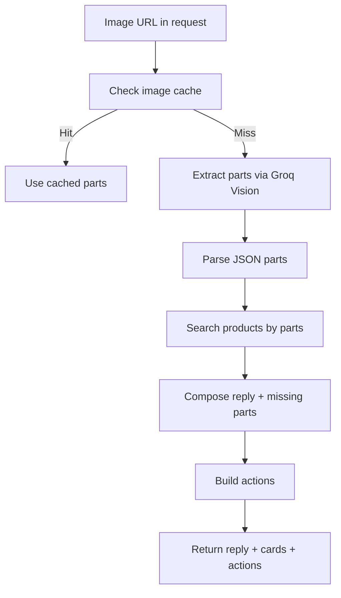

### Fallback flow giữa các model (Text)
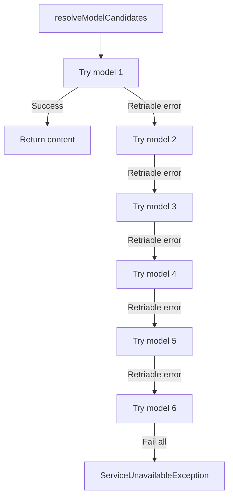

Danh sách model text theo thứ tự ưu tiên:
- `requestedModel` (nếu client chỉ định)
- `GROQ_MODEL_PRIMARY`
- `GROQ_MODEL`
- `GROQ_MODEL_SECONDARY`
- `GROQ_MODEL_TERTIARY`
- fallback mặc định: `qwen/qwen3-32b`

Điều kiện fallback: lỗi retriable hoặc HTTP status `408, 425, 429, 500, 502, 503, 504`.

### Fallback flow giữa các model (Vision)
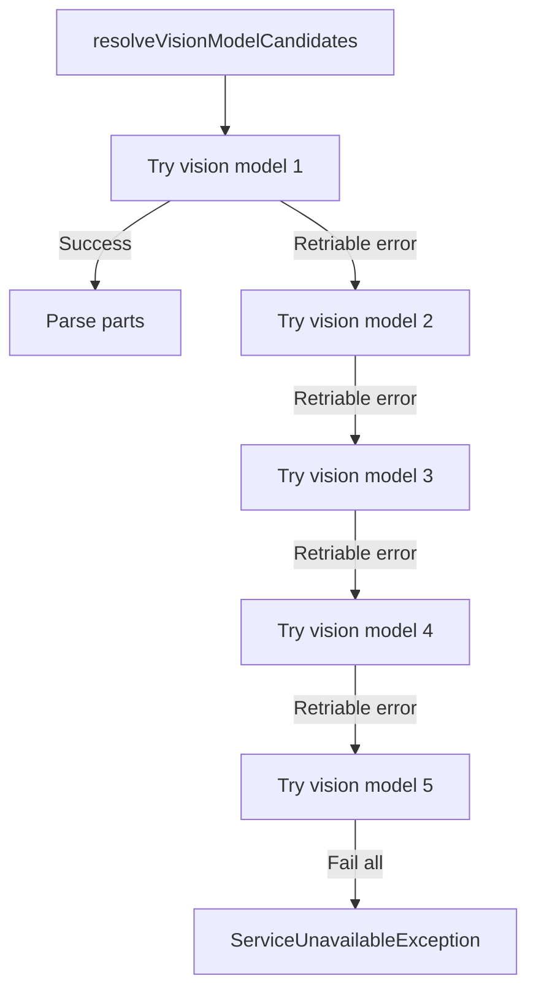

Danh sách model vision theo thứ tự ưu tiên:
- `GROQ_MODEL_VISION`
- `GROQ_MODEL_IMAGE`
- `GROQ_MODEL_PRIMARY`
- `GROQ_MODEL`
- `GROQ_MODEL_SECONDARY`

## Realtime (Socket.IO)
- `product_updated` broadcast khi product thay đổi
- `cart_updated` theo room `user:<id>`
- `db_change` chỉ admin room

## Endpoint chính (rút gọn)
- Auth: `/auth/register`, `/auth/register/send-otp`, `/auth/register/verify-otp`, `/auth/login`, `/auth/social-login`, `/auth/refresh`
- Users: `/users/me`, `/users/me/addresses`, `/users/me/favorites`, `/users/me/search-history`, `/users/me/ai-chat-history`, `/users` (admin)
- Products: `/products`, `/products/:id`, `/products/:id/related`
- Reviews: `/reviews`, `/reviews/product/:productId`
- Carts: `/carts`, `/carts/items`
- Orders: `/orders`, `/orders/:id`, `/orders/:id/cancel`, `/orders/:id/rollback`
- Payments: `/payments/vnpay`, `/payments/vnpay/return`, `/payments/vnpay/ipn`
- Shipments: `/shipments` (admin)
- Transactions: `/transactions` (admin)
- Inventory: `/inventory-movements` (admin)
- Vouchers: `/vouchers`, `/vouchers/available`, `/vouchers/my`
- Banners: `/banners/public`, `/banners` (admin)
- Notifications: `/notifications`, `/notifications/admin`
- Upload: `/upload/image`, `/upload/image/by-url`, `/upload/file`
- AI: `/ai/chat`, `/ai/confirm`
- Search trends: `/search-trends`, `/search-trends/increment`
- Health: `/health`

## Liên quan
- Mobile: `/Users/levanduy/Nam4/HK2/Mobile/ElectroAI/ElectronicsShop/README.md`
- Admin: `/Users/levanduy/Nam4/HK2/Mobile/ElectroAI/electronics-admin/README.md`
- Tổng quan hệ thống: `/Users/levanduy/Nam4/HK2/Mobile/ElectroAI/readme.md`
